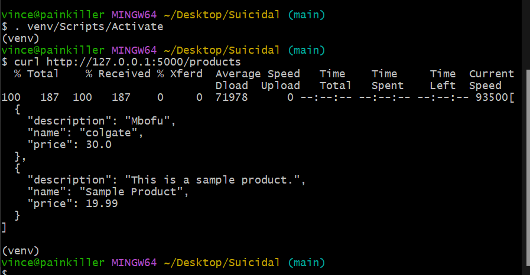
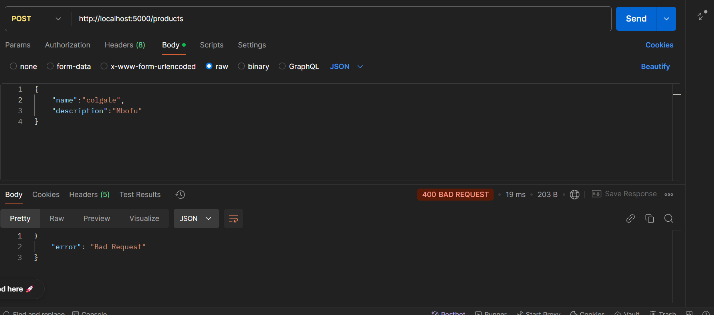

# Simple REST API

1. **Clone the repository:**

   git clone <repository_url>
   cd <repository_name>

2. # creating a virtual n          
    Create: "python -m venv venv"
    to activate: ".\venv\Scripts\Activate.ps1"

3. # installation of dependencies
     pip install -r requirements.txt

4. # running the API
     python app.py with the method testing

5. # Testing the POST and GET methods used to create a product and to get all the products created
      Install postman software
      Using the URL: 'http://localhost:5000/products' create a product and then observe the output port from postman.
      Alternative way of creating a product using gitbash where you run this command:curl -X POST -H "Content-Type: application/json" -d '{"name": "Sample Product", "description": "This is a sample product.", "price": 19.99}' http://127.0.0.1:5000/products but also ensuring that the file app.py is running and then the path in gitbash is set. Note that the virtual environment must be activated using the command . venv/Scripts/Activate
      To view or get the products created type this command: curl http://127.0.0.1:5000/products and it produces the output of all the products created.
      Testing Error in postman: 
      
